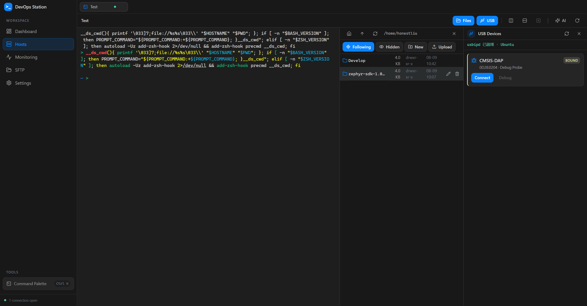
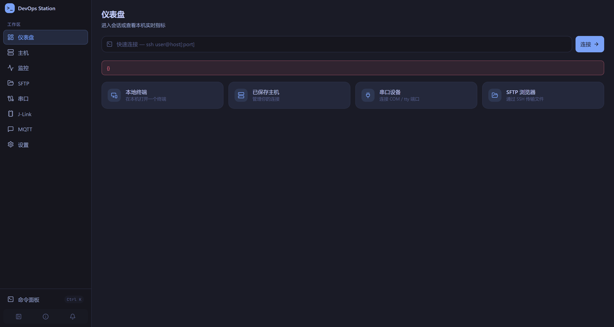
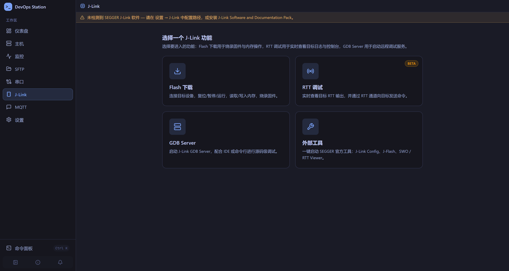
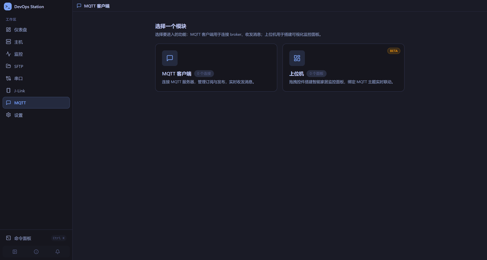

# DevOps Station

> 一个现代化的跨平台终端运维工作台 — SSH + SFTP + 串口 + BLE + WSL + J-Link + MQTT + FRP + 本地终端，九合一。
>
> Termius 的连接管理 · MobaXterm 的一体化 · VS Code 的界面语言 · Serial Studio 的串口绘图 · MQTTX 的消息体验 · 外加内置 Git / Docker / 代码片段面板与 AI 助手。

基于 **Tauri v2 + Rust + React 18 + TypeScript** 构建，原生性能，安装包体积小。



## 界面预览

| | |
| --- | --- |
|  |  |
| 工作台首页（Dashboard） | J-Link 模块选择页（统一顶栏 + 2×2 卡片） |
|  | |
| MQTT 模块选择页 | |

## 功能特性

### 🖥 SSH 终端

- 基于 `russh` 的纯 Rust 异步 SSH 实现（`ring` 后端，Windows 免 CMake/NASM）
- `xterm.js` 渲染，完整 ANSI 256 色 + True Color，支持 `bash` / `zsh` / `fish` / `tmux`
- Nerd Font 字形支持（Unicode11 addon），Powerlevel10k 等主题正常显示
- 密码 / 私钥（含 passphrase）/ none 三级自动认证回退
- 首次连接 TOFU 记录 SHA256 主机指纹，**指纹持久化并支持 Known Hosts 管理**（对话框列出 / 删除），**指纹变更（潜在 MITM）会明确告警**
- 终端内搜索、Web 链接点击、自动 fit + PTY resize 同步
- **SSH 端口转发**：本地转发 / 远程转发 / 动态 SOCKS5，会话内可视化管理（`PortForwardPanel`）
- **分屏**：单个 SSH / 本地 / WSL 标签可拆分最多 4 个 pane（`Ctrl+Shift+D` 右分 / `Ctrl+Shift+E` 下分 / `Ctrl+Shift+W` 关 pane / `Ctrl+Shift+方向键` 切换焦点）
- 终端工作区右侧可停靠多个辅助面板（见下）

### 📁 SFTP 文件管理

- 与终端同会话复用 SSH 连接，无需二次认证
- 双栏面板（本地 ↔ 远程）、目录浏览（文件夹优先排序）、面包屑导航、上级跳转
- 上传 / 下载带**实时进度事件**（64KB 分块）
- 新建目录、重命名、删除、权限位编辑
- 远程文件直编（`RemoteFileEditor`）、显示属主 / 大小 / 修改时间
- **持久标签页**：SFTP 是独立标签，离开再回来不会复位

### 🌿 Git 侧边栏

- 停靠在终端工作区右侧的 Git 面板，**跟随活动终端的 cwd**（本地 / SSH / WSL 会话均可，WSL 走 `\\wsl$\<distro>` UNC 共享）
- 工作区状态（改动文件 + 分支快照，单次 IPC 批量获取）、暂存 / 取消暂存
- 提交（支持 **amend**）、新建 / 切换分支、checkout 历史提交
- 文件 diff 弹窗（staged / unstaged）、提交历史 log、单提交 diff、reset
- fetch / pull / push 一键执行
- 可在 **设置 → 功能特性** 中开关

### 🐳 Docker 面板

- 停靠在终端工作区右侧，检测 Docker 可用性、列出容器与镜像
- 容器的启动 / 停止 / 重启等常用操作
- 本地 / SSH / WSL 会话均可用，可在 **设置 → 功能特性** 中开关

### 📝 代码片段

- 终端代码片段面板（`SnippetPanel`），常用命令一键插入 / 发送到终端
- SQLite 持久化，可在 **设置 → 功能特性** 中开关

### 📊 设备监控

- **无 Agent**：单条 POSIX shell 探针脚本，通过已建立的 SSH 会话执行
- 采集 CPU 占用率（`/proc/stat` jiffies 差分）、内存、磁盘（`df`）、网络收发速率（`/proc/net/dev` 差分）、温度（`thermal_zone`）、负载、Top 进程
- 本机监控走 `sysinfo`，Dashboard 实时刷新
- ⚠️ 速率类指标需要**连续两次采样**才有值，首次调用为 0

### 🔌 串口 / BLE 工作台

- `serialport-rs`，独立线程阻塞读取，不阻塞 UI
- 波特率 / 数据位 / 校验位 / 停止位 / 流控完整可配
- **三种数据模式**：
  - **Normal** — 带时间戳的日志流，可切 HEX / ASCII 显示
  - **Terminal** — 完整 xterm.js 终端仿真（调试 U-Boot / Linux console）
  - **Plot** — `uPlot` 实时曲线，自动解析 `key:value` / CSV 数值流
- 快捷命令面板（可持久化到 SQLite）
- 行尾控制（None / CR / LF / CRLF）、编码切换（UTF-8 / GBK / HEX）
- 内置 HEX / ASCII / Binary / Decimal 转换器
- **BLE 透传**：蓝牙串口（GATT），与串口共用工作台
- **日志录制**：串口数据流可记录回看（`SerialRecordView`）

### 🪟 WSL（Windows）

- WSL 发行版选择器，直接连入子系统 shell
- WSL 文件系统浏览（通过 SFTP 通道）
- **WSL USB 设备管理器**：基于 `usbipd-win` 将 USB 设备附加到 WSL

### 🔧 J-Link 烧录 / 调试

- **模块化选择页**（统一顶栏 + 2×2 卡片，与 MQTT 选择页同一套视觉语言）：
  - **Flash 下载** — 探针连接配置 + 复位 / 暂停 / 运行 / 全片擦除 + 内存读写 + 固件烧录，全宽操作输出控制台
  - **RTT 调试** — J-Link Commander + JLinkRTTClient 子进程对，流式收发 RTT 通道 0（复用串口工作台的 RX/TX 视图、快捷发送、TEXT/HEX 编码）
  - **GDB Server** — 启动 / 停止 J-Link GDB Server，实时日志（后端长驻进程，跨标签切换不中断）
  - **外部工具** — 弹窗一键启动 SEGGER 官方工具（J-Link Config / J-Flash / SWO Viewer / RTT Viewer）
- 驱动设备数据库加载（`JLinkDevices.xml` + `-DeviceList` 回退 + 精选兜底列表），自定义设备可直接输入
- 未安装 J-Link 软件时顶栏下方出现提示横幅；安装状态自动检测

### 🌐 MQTT 客户端 + 上位机

- **MQTT 客户端工作区**：连接配置持久化（MQTT / MQTTS / WS / WSS），订阅管理、发布（QoS / retain / 载荷）、消息流方向过滤（收 / 发 / 全部）
- 发布前提示「该主题没有匹配订阅」避免发入虚空
- **HMI 上位机（DashPage）**：拖拽控件搭建可视化监控面板，控件绑定 MQTT 主题作为数据源，实时刷新；面板可持久化
- 模块选择页与 J-Link 同构（统一顶栏 + 模块卡片）

### 🌐 FRP 内网穿透

- 独立标签管理 FRP 隧道（`frpc`），配置可视化编辑

### 🤖 AI 助手

- 可停靠的右侧 AI 面板（`Ctrl/⌘ + .` 开关，可拖拽调宽）
- 多会话历史（localStorage 持久化）、流式输出、Markdown 渲染
- 可接入 **OpenAI / Ollama / 自定义 OpenAI 兼容** 后端
- **终端上下文**：将当前终端状态注入对话，让 AI 看懂你在做什么
- **Agent 模式**：自动执行多步任务，可选「自动运行」回写终端
- **知识库（RAG）**：加载本地文档目录，作为检索增强上下文
- **一键任务**：
  - 分析终端日志（排错）
  - 解析串口协议
  - 监控指标洞察
- 对话中的代码块支持「插入终端」/「运行到终端」
- 终端内选中文本 → 右键 → 直接问 AI（`TerminalInlineAsk`）

### 🔔 AI 审批通知 + 快捷键快速审批

- 后端 `perm.rs` 在 SSH / PTY / 串口 / BLE 数据流上实时扫描 Claude Code、Codex、Aider 等 CLI 的审批提示
- 触发后：右下角**铃铛**弹出审批卡片（显示摘要 + 「批准」/「跳转到终端」按钮）+ 系统桌面通知
- **节流去重**：同一会话的重复审批不会刷屏
- **快捷键一键批准**（默认 `Ctrl+Shift+Enter`，可在设置里重录）：向正在等待审批的会话发送回车，确认高亮项，无需离开当前视图

### 🧭 全局体验

- 浏览器式**多标签页**，状态点实时反映连接中 / 已连接 / 断开 / 错误
- **标签关闭确认**（可设置开关）：关闭标签前弹窗确认，防止误杀正在运行的会话
- **命令面板** `Ctrl/Cmd + K` — 页面跳转、主机连接、新建会话、主题切换
- **11 套主题**：Tokyo Night（默认）/ Dark / Light / Nord / Dracula / One Dark / GitHub Dark / Gruvbox / Monokai / Solarized Light / Catppuccin Latte，终端配色与 UI 同步
- 侧边栏导航：Dashboard / Hosts / Monitoring / SFTP / Serial / J-Link / MQTT / Settings，可折叠
- 右键上下文菜单：随处新建终端、连接主机、打开 SFTP 等
- **完整配置导出 / 导入（数据迁移）**：一键打包设置、主机、快捷命令**以及导入的自定义字体文件**（base64 内嵌），在新应用导入后完全复原；支持「合并」与「替换」两种模式，可选明文包含密码等凭据

### 🔐 数据存储

- `rusqlite`（bundled SQLite）持久化主机、快捷命令、设置、代码片段、MQTT 连接配置、HMI 面板
- 凭据使用 **XChaCha20-Poly1305** 加密落盘，密钥文件 `secret.key`（Unix 下 0600）
- 列表接口返回 `__saved__` 哨兵值，密文永不出后端边界，仅在连接时解密

> **安全说明（务必知悉）**：当前方案防的是「磁盘上的明文」，**不防**「能读取你 home 目录的攻击者」——`secret.key` 与数据库同处一地。真正的操作系统级密钥托管请接入 `tauri-plugin-stronghold` 或系统 Keychain，代码中已预留升级点。

---

## 快捷键

| 快捷键（Windows / Linux） | macOS | 作用 |
| --- | --- | --- |
| `Ctrl + K` | `⌘ K` | 命令面板 |
| `Ctrl + .` | `⌘ .` | 开关 AI 助手面板 |
| `Ctrl + Shift + Enter` | 同左（可配置） | 一键批准当前等待的 AI 审批 |
| `Ctrl + Shift + D` | 同左 | SSH / 本地 / WSL 标签向右分屏 |
| `Ctrl + Shift + E` | 同左 | 向下分屏 |
| `Ctrl + Shift + W` | 同左 | 关闭当前聚焦的 pane |
| `Ctrl + Shift + ←/→/↑/↓` | 同左 | 在 pane 间移动焦点 |

> 分屏与审批快捷键可在 **设置 → 快捷键** 中重录；审批快捷键支持自定义组合。

---

## 平台支持

系统相关的功能按平台裁剪：不存在的功能（如 WSL）在 macOS / Linux 上不显示，也不会调用后端。

| 功能 | Windows | macOS | Linux |
| --- | :---: | :---: | :---: |
| SSH / SFTP 终端 | ✅ | ✅ | ✅ |
| SSH 端口转发（本地 / 远程 / SOCKS5） | ✅ | ✅ | ✅ |
| Git 面板 / Docker 面板 / 代码片段 | ✅ | ✅ | ✅ |
| 串口调试 | ✅ | ✅ | ✅ |
| BLE 蓝牙串口 | ✅ | ✅（需在 系统设置 → 隐私与安全性 → 蓝牙 授权） | ✅（需运行 bluez） |
| 本地终端 | PowerShell / cmd / Git Bash | `$SHELL`（bash / zsh / fish） | `$SHELL` |
| J-Link 烧录 / 调试 | ✅ | ✅ | ✅ |
| MQTT 客户端 / 上位机 | ✅ | ✅ | ✅ |
| FRP 内网穿透 | ✅ | ✅ | ✅ |
| 设备监控 | ✅ | ✅ | ✅ |
| WSL 发行版 / 文件系统 | ✅ | — | — |
| WSL USB 设备管理器（usbipd-win） | ✅ | — | — |
| 桌面通知 | AUMID + Start Menu（自归属） | 系统通知 | D-Bus 通知 |

> macOS 打包时 `src-tauri/Info.plist` 声明了蓝牙使用说明（`NSBluetoothAlwaysUsageDescription`），首次使用 BLE 会弹出系统授权。

---

## 技术栈

| 层 | 技术 |
| --- | --- |
| 桌面框架 | Tauri v2 |
| 后端 | Rust · russh 0.62 · russh-sftp 2.4 · portable-pty 0.9 · serialport 4.9 · sysinfo 0.39 · rusqlite 0.40 · tokio · regex · notify-rust |
| 前端 | React 18 · TypeScript 5 · Vite 6 · TailwindCSS 3 · Zustand 5 |
| 终端 | xterm.js 5.5（fit / search / web-links / unicode11） |
| 图表 | uPlot 1.6 |
| AI | OpenAI / Ollama / 自定义兼容后端（流式） |
| 加密 | chacha20poly1305（XChaCha20-Poly1305） |

---

## 项目结构

```
devops-station/
├── src/                          # 前端
│   ├── main.tsx                  # 入口：挂载 + 启动加载设置/主机
│   ├── App.tsx                   # AppShell：侧边栏 + 标签栏 + 页面路由 + 全局快捷键
│   ├── components/
│   │   ├── Sidebar.tsx           # 主导航 + 底部命令面板/折叠/关于/审批铃铛
│   │   ├── TabBar.tsx            # 浏览器式标签（状态点 + 关闭确认弹窗）
│   │   ├── CommandPalette.tsx    # Ctrl/Cmd+K 命令面板
│   │   ├── NotificationBell.tsx  # AI 审批通知铃铛
│   │   ├── HostDialog.tsx / HostKeyPrompt.tsx  # 主机编辑 / 未知主机指纹确认
│   │   ├── QuickCommandsEditor.tsx
│   │   ├── MetricsView.tsx       # 监控卡片组
│   │   ├── ConnectionOverlay.tsx # 连接中/错误遮罩
│   │   ├── ContextMenu.tsx       # 全局右键菜单
│   │   ├── FontDialog.tsx / FontPicker.tsx
│   │   ├── ui.tsx                # Button/Input/Select/Dialog/Drawer/ModuleHeader...
│   │   ├── git/GitPanel.tsx      # Git 侧边栏（状态/分支/提交/diff/log/pull/push）
│   │   ├── docker/DockerPanel.tsx# 容器与镜像管理
│   │   ├── snippets/             # 代码片段面板
│   │   ├── files/                # FileBrowserPanel（SFTP/WSL/本地文件浏览器）
│   │   ├── terminal/             # Terminal.tsx / SplitView / SplitControls
│   │   ├── sftp/                 # SftpPanel / SftpDualPanel / PermsDialog / RemoteFileEditor / WslPanel
│   │   ├── serial/               # SerialPlot / Converter / PortPicker / QuickSendPanel / SendBar / SerialRecordView
│   │   ├── workspace/            # Ssh / Local / Serial / Wsl / Frp / Sftp / Mqtt / JLink 各工作台
│   │   │   └── jlink/            # JLinkFlash / Rtt / GdbWorkspace + JLinkShared / ToolsDialog
│   │   └── wsl/                  # DistroPicker / USBDeviceCard / WSLUSBPanel
│   ├── dash/                     # HMI 上位机（DashBoard / WidgetRenderer / registry / miniEditor）
│   ├── ai/                       # AiPanel + agent/context/knowledgeBase/tasks/terminalAi/
│   │                              #   errorScan(审批扫描前端守门)/useAiStore/useAiAgent 等
│   ├── pages/                    # Dashboard / Hosts / Monitoring / Settings / Sftp / Serial / JLink / Mqtt / Dash
│   ├── store/                    # Zustand: useAppStore / useHostsStore / useTabsStore /
│   │                              #   useJlinkStore / useSnippetsStore / useHostKeyStore /
│   │                              #   usePermStore / useSessionStore / useContextMenu / useUpdaterStore
│   ├── lib/                      # api.ts(IPC封装) types.ts utils.ts themes.ts shortcut.ts
│   │                              #   quickApprove.ts bleGatt.ts serialCodec.ts dataLink.ts platform.ts
│   ├── hooks/useTerminalTheme.ts
│   ├── i18n/                     # zh.ts / en.ts / index.ts
│   └── styles/globals.css        # 11 套主题 CSS 变量
└── src-tauri/                    # 后端
    ├── src/
    │   ├── lib.rs                # AppState + 60+ 个 #[tauri::command]
    │   ├── types.rs              # 前后端共享类型（serde camelCase）
    │   ├── error.rs              # AppError（IPC 可序列化）
    │   ├── perm.rs               # AI 审批扫描 + 节流 + 系统通知
    │   ├── notify.rs             # 桌面通知封装（含控制字符清洗）
    │   ├── ssh/{mod,sftp,metrics}.rs
    │   ├── serial/mod.rs
    │   ├── pty/mod.rs
    │   ├── ble/mod.rs
    │   ├── wsl/{mod,parser,device_filter,usbip}.rs
    │   ├── jlink.rs / frp.rs / mqtt.rs / git.rs / docker.rs
    │   ├── ai/{mod,provider}.rs  # AI 流式对话后端
    │   ├── kb.rs                 # 知识库（RAG 检索）
    │   ├── stream.rs / sync.rs
    │   ├── system/mod.rs
    │   └── storage/{mod,crypto}.rs
    ├── Cargo.toml
    └── tauri.conf.json
```

---

## 开发与构建

### 前置要求

- Node.js ≥ 18（本项目验证于 22.22.2）
- Rust stable（验证于 1.97.1 msvc）
- Windows：MSVC Build Tools + WebView2 Runtime
- Linux（Debian/Ubuntu）：`libwebkit2gtk-4.1-dev libssl-dev libgtk-3-dev libayatana-appindicator3-dev librsvg2-dev libudev-dev libdbus-1-dev` —— 串口需要 `libudev`，BLE 蓝牙走 D-Bus + BlueZ
- macOS：Xcode Command Line Tools

### 命令

```bash
npm install

npm run dev        # 仅前端 Vite 开发服务器（localhost:1420）
npm run build      # tsc --noEmit && vite build（前端类型检查 + 打包）

npm run app:dev    # Tauri 桌面开发模式（前端 + Rust 热重载）
npm run app:build  # 打包生产安装包（msi/dmg/AppImage）
```

> `cargo` / `rustc` 若不在 PATH：`export PATH="$HOME/.cargo/bin:$PATH"`

### IPC 约定

所有二进制数据（终端输出、串口字节流）跨 Tauri IPC 边界时使用 **base64** 编码，避免非法 UTF-8 被破坏。

事件命名规范：

| 事件 | 说明 |
| --- | --- |
| `ssh-data-{sessionId}` / `ssh-closed-{sessionId}` | SSH 数据流 / 会话关闭 |
| `pty-data-{sessionId}` / `pty-closed-{sessionId}` | 本地 PTY |
| `serial-data-{sessionId}` / `serial-closed-{sessionId}` | 串口 |
| `ble-data-{sessionId}` / `ble-closed-{sessionId}` | BLE |
| `sftp-progress` | 上传/下载进度 |
| `perm-request` | AI CLI 审批请求（驱动铃铛 + 系统通知） |
| `approval-shortcut` | 一键批准快捷键命中（转发给等待中的会话） |
| `ai-chunk-{reqId}` / `ai-done-{reqId}` | AI 流式增量 / 完成 |
| `jlink-gdb-log` | J-Link GDB Server 日志行 |
| `jlink-rtt-data` / `jlink-rtt-log` | RTT 通道 0 字节流（base64）/ 诊断日志 |

---

## 已知限制 / 后续路线

- [ ] **多终端批量执行**（一条命令广播到多个 SSH 会话）
- [ ] **会话录制与回放**（asciinema `.cast`）
- [ ] 主机**分组/文件夹** + 导入 `~/.ssh/config`（Known Hosts 已支持管理）
- [ ] 监控**历史趋势** + 阈值告警（超 CPU/内存弹桌面通知）
- [ ] SFTP **断点续传** + 目录递归传输
- [ ] 启动**自动恢复上次会话/连接**
- [ ] 凭据托管升级到 **Stronghold / 系统 Keychain**
- [ ] 串口 Plot **自定义解析规则**（当前为启发式 `key:value` / CSV）
- [ ] 插件系统

---

## License

MIT
